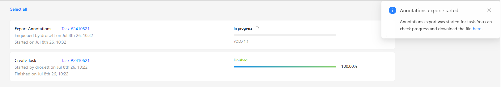

# CVAT guide

How to label a small seed dataset in [CVAT](https://app.cvat.ai/) and export it in **YOLO 1.1** format for this repo.

## 1. Create a new task

Open the **Tasks** page and click the blue **+** button.


Choose **Create a new task**.


## 2. Name the task and upload images

Enter a task name, then upload your images (`.jpg`, `.jpeg`, `.png`) from **My computer**.


## 3. Add your class label(s)

In the **Constructor** tab, type your class name (for example `fish`, `cat`, …) and add it.  
These names become `obj.names` when you export.


## 4. Submit the task

Click **Submit & Open**.


You land on the task page.


## 5. Open the job

Under **Jobs**, click the job link to open the annotation editor.


## 6. Draw bounding boxes

The annotation workspace opens on your first image.


Select **Draw new rectangle**, pick your label, use **By 2 points**, then click **Shape**.


Click two corners around each object. Adjust the box if needed, then **Save**. Move through all frames and label them.


## 7. Export as YOLO 1.1

Go back to **Tasks**, open the task **Actions** menu (⋮), and choose **Export task dataset**.


Set:

- **Export format:** `YOLO 1.1`
- **Save images:** turn **on** (so images are included with the labels)
- Optional custom zip name

Click **OK**.


Wait until the export finishes, then download the zip.



## 8. What you get

After unzipping, you should see something like:


| File / folder | What it is |
|---|---|
| `obj.names` | Class names (one per line) |
| `obj.data` | Dataset config from CVAT |
| `train.txt` | List of image paths |
| `obj_train_data/` | Images + matching `.txt` labels |

Each label file looks like this (YOLO format):

`class_id x_center y_center width height` (values normalized 0–1)


## 9. Copy into this repo

Put the export here:

```
data/dataset/
  obj.names
  obj.data          # optional
  train.txt         # optional
  obj_train_data/   # .jpg/.png images + matching .txt labels
```

Then continue with training in the main [README](README.md).
