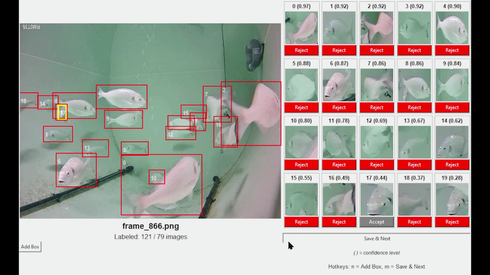
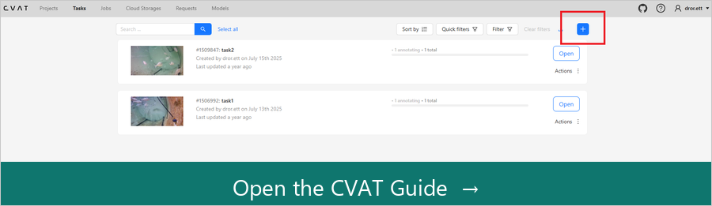

# YOLO Auto-Labeler

<p align="center">
  
</p>

<p align="center">
  <a href="https://www.python.org/"></a>
  <a href="https://github.com/ultralytics/ultralytics"></a>
  <a href="LICENSE"></a>
  <a href="https://app.cvat.ai/"></a>
</p>

Semi-automatic labeling for YOLO datasets. You label a small seed set (e.g. in CVAT), train a model, then use that model to propose boxes on new images — you only review and fix them.

Works with **your** images and classes. This repo does not include a dataset or trained weights.

## Requirements

- Python 3.8+
- Windows recommended (GUI uses `tkinter`, usually included with Python)

```bash
pip install -r requirements.txt
```

## Folder layout

```
data/
  dataset/
    obj.names               # class names from CVAT (one name per line)
    obj_train_data/         # .jpg/.jpeg/.png images + matching .txt labels
  images_to_label/          # .jpg/.jpeg/.png images to label
  labels/                   # .txt labels written by the auto-labeler
models/
  trained/weights/best.pt   # trained YOLO weights (.pt)
CVAT_guide_images/          # screenshots for the CVAT guide
```

## Workflow

### 1. Label a small seed set in CVAT

1. Create a CVAT task and draw bounding boxes.
2. Export in **YOLO 1.1** format (turn **Save images** on).
3. Copy the export into this repo:
   - images + matching `.txt` labels → `data/dataset/obj_train_data/`
   - `obj.names` (and the other CVAT files) → `data/dataset/`

Each image needs a label file with the same name, e.g. `photo.jpg` → `photo.txt`.  
Class names come from CVAT via `obj.names` — no need to edit them by hand.

**New to CVAT?** Follow the full screenshot walkthrough:

[](CVAT%20guide.md)

👉 [**CVAT guide.md**](CVAT%20guide.md) — create a task, draw boxes, export YOLO 1.1

### 2. Train

```bash
python basic_YOLO_train.py
```

When it finishes, weights are at:

`models/trained/weights/best.pt`

### 3. Auto-label new images

1. Put new images in `data/images_to_label/`.
2. In `auto_labeler.py`, set `model_path` to your trained weights, for example:

   ```python
   model_path = r"models\trained\weights\best.pt"
   ```

   (`images_dir` and `labels_dir` already point at the repo folders by default.)
3. Run:

   ```bash
   python auto_labeler.py
   ```

### 4. Review in the GUI

- Red box = accepted, gray = rejected (click a box or its thumbnail to toggle).
- **Add Box** (`n`) — draw a missing box.
- **Save & Next** (`m`) — write the YOLO `.txt` label and go to the next image.

Images that already have a label in `data/labels/` are skipped.

Label format: `class_id x_center y_center width height` (normalized 0–1).

## Tips

- Start with a small, carefully labeled seed set, then grow the dataset with the auto-labeler.
- You can merge new labels back into `obj_train_data/` and retrain for better proposals.
- Manual boxes in the GUI are currently saved as **class 0**. Multi-class editing in the GUI is not supported yet.

## License

[MIT](LICENSE)
